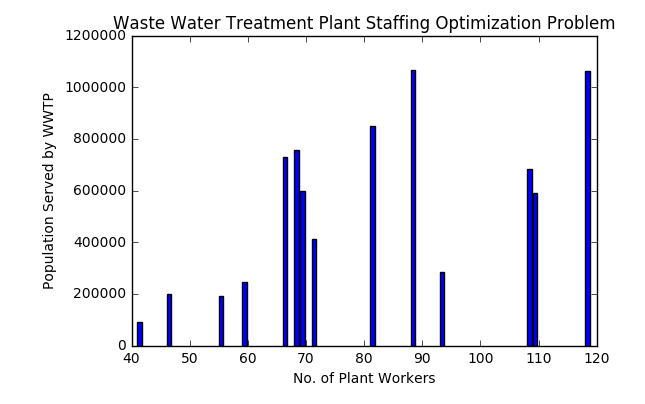

Waste Water Treatment Plant - NYC : Correlation with No. of Workers and Population Served

In this section we tried to experiment and learnt to use Pandas Library of Python.

We Chose a [dataset within the CUSP data facility (DF)](https://datahub.cusp.nyu.edu/data-catalog) that was available in CSV format. We chose one that had at least 2 numerical value columns.The data stored in the CDF was indexed to an environmental variabl "DFDATA" that points to the path: /gws/open/NYCOpenData/nycopendata/data/

1. For the first part we have chosen the Waste Water Treatment Plant dataset from Department of Environmental Protection, NYC. This was made for State Pollutant Discharge Elimination System. A Detailed Report of the same is available in this link [here](http://www.nyc.gov/html/dep/pdf/harbor/spdes_bmp_report_2012.pdf)

In this analysis we have tried to derive a correlation between The Staff Count at plant and the Population served. Find below the correlation between them. It can be noted that Hunts Point WWTP has higher staff for the population it serves.

2. For this part I have tried to map the correlation between the Commuter Car Model to the License expiration date.
